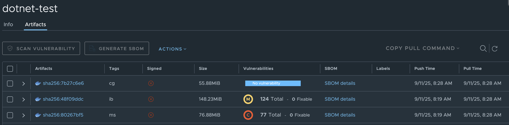

### How Do I Build?

Run the generate containers Bash script:

```bash
bash ./generate_dockers.sh
```

### How do I test?

```bash
docker run --rm \
  -e KEYCLOAK_BASE_URL="https://identity.omni.af.mil" \
  -e KEYCLOAK_REALM="OMNI" \
  registry.omni.af.mil/dotnet_test/dotnet-test:ms
```
```bash
docker run --rm \
  -e KEYCLOAK_BASE_URL="https://identity.omni.af.mil" \
  -e KEYCLOAK_REALM="OMNI" \
  registry.omni.af.mil/dotnet_test/dotnet-test:ib
```
```bash
docker run --rm \
  -e KEYCLOAK_BASE_URL="https://identity.omni.af.mil" \
  -e KEYCLOAK_REALM="OMNI" \
  registry.omni.af.mil/dotnet_test/dotnet-test:cg
```

### How does it Compare?

Check the Newly Uploaded Containers in Harbor, Compare Number of Trivvy Vulnerabilities and Container Size.



| Tag | Container Size | Total Open Vulnerabilities |
|-----|----------------|-----------------|
| `dotnet-test:ms` | 76.88 MiB | 77 |
| `dotnet-test:ib` | 148.23 MiB | 124 |
| `dotnet-test:cg` | 55.88 MiB | 0 |
