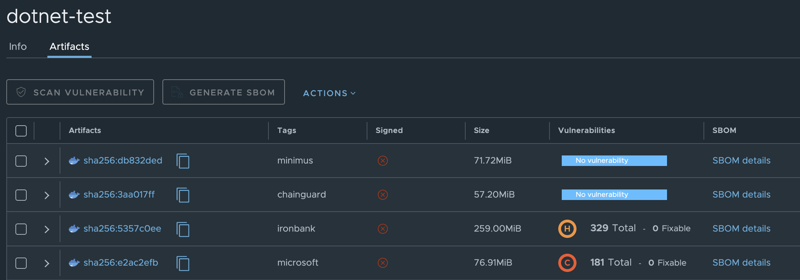

### How Do I Build?

Run the generate containers Bash script:

```bash
bash ./generate_dockers.sh
```

### How do I test?

```bash
docker run --rm \
  -e KEYCLOAK_BASE_URL="https://identity.omni.af.mil" \
  -e KEYCLOAK_REALM="OMNI" \
  registry.omni.af.mil/dotnet_test/dotnet-test:microsoft
```
```bash
docker run --rm \
  -e KEYCLOAK_BASE_URL="https://identity.omni.af.mil" \
  -e KEYCLOAK_REALM="OMNI" \
  registry.omni.af.mil/dotnet_test/dotnet-test:ironbank
```
```bash
docker run --rm \
  -e KEYCLOAK_BASE_URL="https://identity.omni.af.mil" \
  -e KEYCLOAK_REALM="OMNI" \
  registry.omni.af.mil/dotnet_test/dotnet-test:chainguard
```
```bash
docker run --rm \
  -e KEYCLOAK_BASE_URL="https://identity.omni.af.mil" \
  -e KEYCLOAK_REALM="OMNI" \
  registry.omni.af.mil/dotnet_test/dotnet-test:minimus
```

### How does it Compare?

Check the Newly Uploaded Containers in Harbor, Compare Number of Trivvy Vulnerabilities and Container Size.



| Tag | Container Size | Total Findings | Fixable | FIPS 140-3 Compliant |
|-----|----------------|-----------------|-----------------|-----------------|
| `dotnet-test:microsoft` | 76.91 MiB | 181 | 0 | No |
| `dotnet-test:ironbank` | 259.00 MiB | 329 | 0 | Yes |
| `dotnet-test:chainguard` | 57.20 MiB | 0 | 0 | No |
| `dotnet-test:minimus` | 71.72 MiB | 0 | 0 | Yes |
